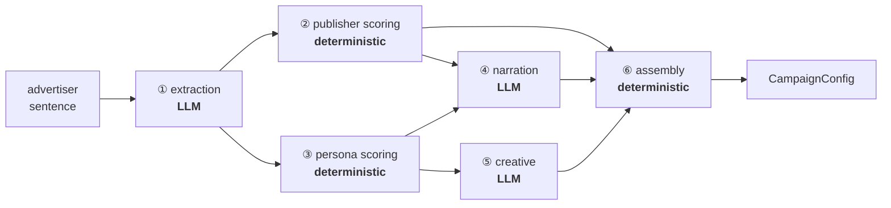

# Ad Placement Engine

An advertiser describes their business in a sentence. The system returns ranked publishers with per-component reasoning, 3–5 persona-tuned creative variants, and a launchable campaign config — every number traceable to how it was computed.

## Run it

Needs your own Gemini API key (free, instant): **https://aistudio.google.com/apikey**

```bash
cp backend/env.sample backend/.env    # paste your key on the LLM_API_KEY line
make install
make dev                              # backend :8000, frontend :5173
```

`GET /health` is a cheap liveness endpoint (used to keep the free hosted instance awake without invoking the pipeline). `make test` runs the scoring suite; `make types` regenerates the frontend types from the backend's Pydantic models. The key stays server-side — `.env` is gitignored and the React bundle contains no key handling.

**Stack:** React + TypeScript + shadcn/ui · Python + FastAPI + Pydantic · any OpenAI-compatible LLM (defaults to Gemini; switching providers is a handful of env vars, not a code change).

## The bet everything follows from

**The LLM does language. A plain scoring function does ranking.** Three LLM calls per run — extraction, narration, creative. Ranking, budget allocation and bid selection are deterministic Python with tests.

Not purity: *"why was this publisher excluded?"* has to answer the same way twice. With named components (`category_fit`, `price_fit`, `audience_fit`, `tone_fit`) the exclusion reason is a lookup — the lowest-scoring one — not a re-generation that might differ on the second ask. The narration LLM explains real computed numbers; it never invents one.



④ and ⑤ run concurrently — both need only the scores, not each other. Full diagrams and the decision log: [`docs/architecture.md`](docs/architecture.md).

## Easy vs hard

**Easy:** calling an LLM, structured output (Pydantic + the SDK removes all parsing code), rendering results.

**Hard — where the work actually went:**

1. **Two taxonomies that don't share a vocabulary.** The model returned `household_goods` for a cleaning brand while the right publishers sat under `home` and `groceries`. Fuzzy matching can't bridge that, so extraction now *selects from the catalog's own vocabulary* and scoring matches only those terms.
2. **Irrelevant publishers scored 36/100.** `price_fit` plus a neutral `audience_fit` paid out ~36 points for zero category overlap — a sock retailer looked "close on AOV" to a dental SaaS. Those signals are only meaningful *conditional* on category relevance, so category now gates the composite. Off-topic advertisers dropped 36 → 6.
3. **Fit and viability are different axes.** *"B2B SaaS for dental practices"* is a high-confidence extraction with zero viable inventory. Confidence asks whether we understood the input; viability asks whether this catalog can serve it. Conflating them tells a vague-but-servable advertiser it's in the wrong market.

Also: reach is a constraint, not a tiebreaker (spend is capped at 20% of deliverable inventory), and weak personas make the model fabricate product claims to bridge the gap — fixed with a fit floor plus an explicit no-fabrication rule.

**Every one of these was found by running all 15 sample advertisers** (`eval/run_examples.py` → `eval/output.md`), not by reasoning about the code. Most are invisible on the happy-path example.

## What I cut

Multi-turn disambiguation (low confidence gets one "add detail and re-run" prompt), persistence, auth, an LLM-judge eval suite, and image creative. None change what the prototype demonstrates.

## Next week

1. **Use the embeddings for retrieval, not just scoring.** They re-rank 20 rows in a loop today; the same vectors are what candidate generation over a 150M-profile graph runs on — ANN retrieval first, this re-ranker on top.
2. **A labeled eval set with regression runs per prompt change.** The current script prints 15 outputs for a human to read; it doesn't fail a build. Every bug above would have been caught earlier by one that does.
3. **Persist the extraction.** `temperature=0` narrows run-to-run variance but doesn't remove it, so the same advertiser can still yield a different ranking. Reproducibility comes from storing the extracted profile and re-scoring from it — not from hoping the model repeats itself.
