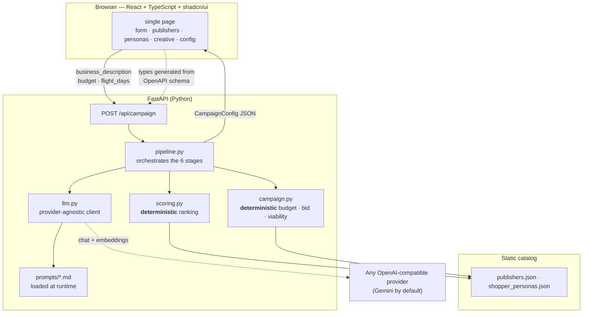
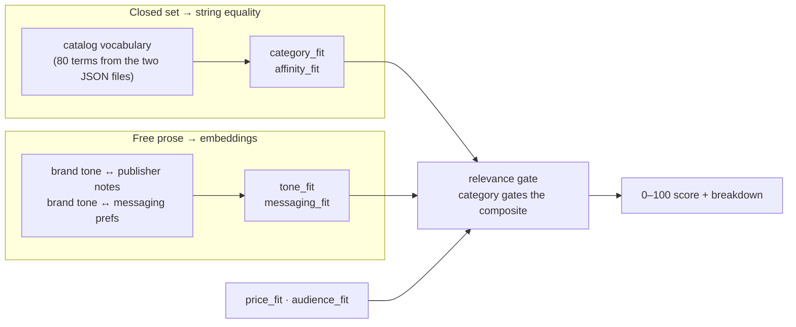
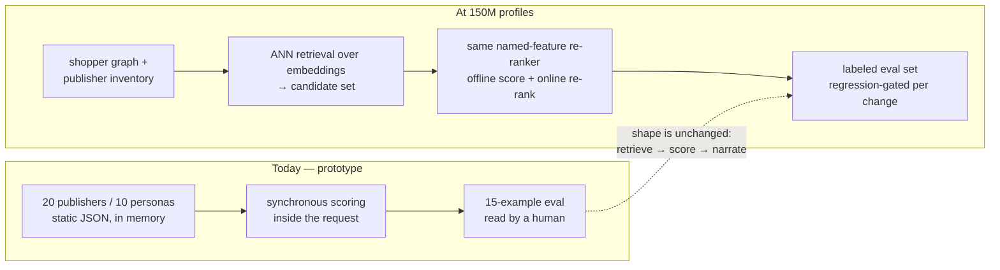

# Architecture & decision log

Companion to the one-page README. This is the "why", including the options
rejected and what the evidence was.

## System

The frontend's types are generated from the backend's OpenAPI schema
(`make types`), so the Pydantic models are the single source of truth and the
contract cannot silently drift.

## Where each signal comes from

Two matching strategies because there are two kinds of signal. Category is a
closed set, so equality is exactly right — the trick is constraining extraction
to *the catalog's own vocabulary* so both sides speak it. Tone and messaging
are free prose on both sides, where "sustainable" and "eco-motivated buyers"
are the same claim with zero shared tokens, so those use embeddings
(`app/semantic.py`). All strings are embedded in one batched request per run
and cached for the process.

When embeddings are unavailable — a provider without `/embeddings`, or an
exhausted quota — the signal degrades to keyword matching, and a keyword miss
returns **neutral (50), not zero**. That distinction matters: scoring an
unmeasurable signal as zero dragged every publisher down ~15 points and
shifted campaigns across the viability thresholds those scores are compared
against. The failure is logged rather than silent, which is how it was found.

## Decision log

| # | Decision | Rejected alternative | Why |
|---|---|---|---|
| 1 | LLM does language; a scoring function ranks | Ask the LLM to rank the catalog | Ranking must be reproducible and auditable. "Why was this excluded" becomes a lookup on the lowest-scoring component instead of a re-generation that may differ next time. Also the only shape that survives a catalog larger than 20 rows. |
| 2 | Extraction picks from the catalog vocabulary | Let the model emit free-text categories | Free text produced `household_goods` for a cleaning brand while the right publishers sat under `home`/`groceries`. Matching a free taxonomy against a fixed one is a losing game — constrain the free side. |
| 3 | Category gates the composite | Plain weighted sum | Price and audience proximity paid ~36/100 to publishers with *zero* category overlap. Those signals are only meaningful conditional on relevance. Off-topic advertisers went 36 → 6. |
| 4 | Viability separate from confidence | One "is this good" score | They're different questions. A dental-SaaS advertiser is understood perfectly (high confidence) and unservable (zero viability). Conflating them told a vague-but-servable advertiser it was in the wrong market. |
| 5 | Fit floors on publishers *and* personas | Always return top-5 / top-5 | A flat slice plus a 10% budget floor funded a Gen Z skincare publisher at $500 for a cleaning brand. Weak personas also make the model fabricate product claims to bridge the gap. |
| 6 | Spend capped at 20% of deliverable inventory | Allocate on fit alone | Reach is a planning constraint, not a tiebreaker: fit alone put 45% of budget on a publisher with 4.8M monthly impressions. |
| 7 | OpenAI SDK against any compatible base URL | Provider-specific SDK, or a custom abstraction layer | "LLM-agnostic" via the interface most providers already speak. Switching is three env vars; no adapter layer to maintain. |
| 8 | Prompts loaded from `prompts/*.md` at runtime | Prompt strings inline in Python | The committed files are then literally what executes, rather than a copy that drifts. |
| 9 | `temperature=0` for scoring-path calls, warm for creative | One temperature everywhere | Extraction feeds the deterministic scorer, so variance there changes rankings. Creative is the one call where variation is the point. |
| 10 | Realistic CPM bands, not a function of AOV | `AOV × 0.30–0.45` | That produced an $89 CPM for a $198-AOV publisher — a number no buyer would recognise. AOV shifts where a publisher sits *inside* a band; it doesn't set the band. |

## How the bugs were found

Five substantive defects, all surfaced by execution rather than review:

- **Running the 15 sample advertisers** (`eval/run_examples.py`) exposed the
  taxonomy mismatch, the 36-point noise floor, and the confidence/viability
  conflation. Four of five are invisible on the happy-path example.
- **Testing the deployed app** exposed irrelevant publishers being funded, and
  a no-match campaign that printed "do not launch" while allocating $1,010.
- **A clean `git clone`** exposed that `make install` — the first command in the
  README — failed on a fresh checkout.
- **A UX audit driving real journeys** exposed that five of nine user journeys
  died in the loading state, because "work started" and "work finished" looked
  identical to both automation and users.

## Path to production scale

The embeddings already exist — they re-rank 20 rows in a loop. The same
vectors are what candidate generation runs on at scale; only the retrieval
step is missing. Nothing in the current design gets thrown away, which was
the point of keeping ranking deterministic and feature-named.
